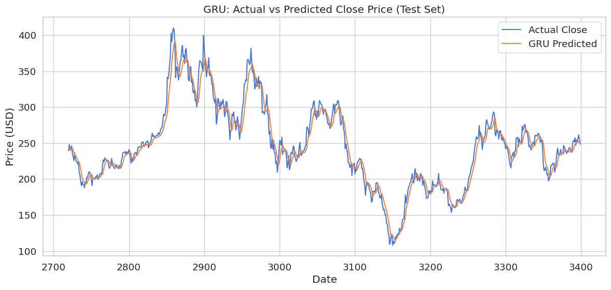

# 🚀 Tesla (TSLA) Stock Price Forecasting

This project explores **time-series forecasting models** for predicting **daily closing prices of Tesla (TSLA)** stock.  
Six models were evaluated and compared using both classical and deep learning approaches.

---

## 📊 Overview

The goal of this project is to identify the most accurate forecasting model for TSLA stock prices.  
Each model was evaluated using the following metrics:

- **RMSE** (Root Mean Square Error)  
- **MAE** (Mean Absolute Error)  
- **MAPE** (Mean Absolute Percentage Error)  
- **SMAPE** (Symmetric Mean Absolute Percentage Error)  
- **R²** (Coefficient of Determination)

After comprehensive testing, the **ARIMA** model emerged as the top-performing model, achieving the highest accuracy and generalization performance.

---

## 🧠 Models Evaluated

| Model | RMSE | MAE | MAPE | R² | SMAPE |
|-------|------|------|------|-----|--------|
| **ARIMA** | **9.420** | **6.750** | **2.740** | **0.973** | **2.730** |
| LSTM | 68.196 | 52.851 | 20.470 | -0.397 | 21.970 |
| **Multivariate LSTM** | 14.978 | 11.008 | 4.490 | 0.933 | 4.460 |
| Prophet | 78.995 | 59.611 | 29.040 | -2.309 | 22.630 |
| **GRU** | 12.378 | 9.259 | 3.752 | 0.954 | 3.750 |
| CNN-LSTM | 15.777 | 11.718 | 4.784 | 0.925 | 4.773 |

---

## 🏆 Performance Highlights

- **Top Model: ARIMA**
  - RMSE: 9.420  
  - R²: 0.973  
  - Best overall accuracy and generalization.
- **Strong Contenders: GRU, Multivariate LSTM, CNN-LSTM**
  - High R² values (0.925–0.954).  
  - Good predictive ability but slightly less accurate than ARIMA.
- **Poor Performance: Prophet and Standard LSTM**
  - Negative R² values indicate poor predictive performance.

---

## 💡 Discussion

- **ARIMA** demonstrated the strongest generalization and precision across all metrics.  
- The **Multivariate LSTM** (with `Open`, `High`, `Low`, and `Volume` inputs) significantly outperformed the univariate LSTM, showing the importance of richer feature sets.  
- Classical models like ARIMA can still outperform deep learning methods in specific, well-structured time-series datasets.

---

## ✅ Recommendation

| Objective | Recommended Model | Reason |
|------------|------------------|--------|
| **Maximum Accuracy** | **ARIMA** | Best R² (0.973), lowest RMSE (9.420) |
| **Fast Inference / Efficiency** | **GRU** | Strong accuracy with lower computational cost |

---

## 🌐 Live Demo on Hugging Face

You can try the deployed model directly here:  
👉 **[Try it on Hugging Face](https://huggingface.co/spaces/Sudip329/Stock_Price_Prediction)**  

---

## 🖼️ Visualization

Below is a sample visualization of the forecasting performance:  

  

---

## 📈 Future Work

- Experiment with **Hybrid ARIMA-LSTM** models to combine statistical and neural methods.  
- Integrate **attention mechanisms** or **Transformers** for improved temporal modeling.  
- Extend the dataset with **macroeconomic indicators** and **news sentiment** for context-aware predictions.

---

## 🧩 Technologies Used

- **Python**  
- **pandas**, **NumPy**, **matplotlib**, **seaborn**  
- **TensorFlow / Keras**  
- **statsmodels** (for ARIMA)  
- **fbprophet** (for Prophet)

---

## 📬 Author

**Sudip Chakrabarty**  
📧 [sudipchakrabarty6@gmail.com]  
💻 [GitHub Profile](https://github.com/Sudip-329)  

---

> “Even in the world of deep learning, sometimes simplicity wins — as ARIMA shows.”
